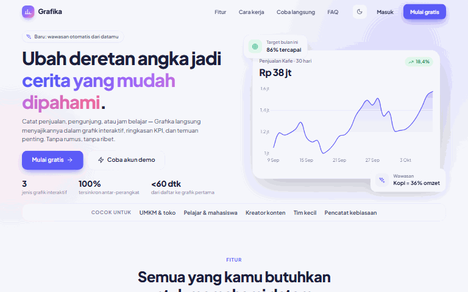
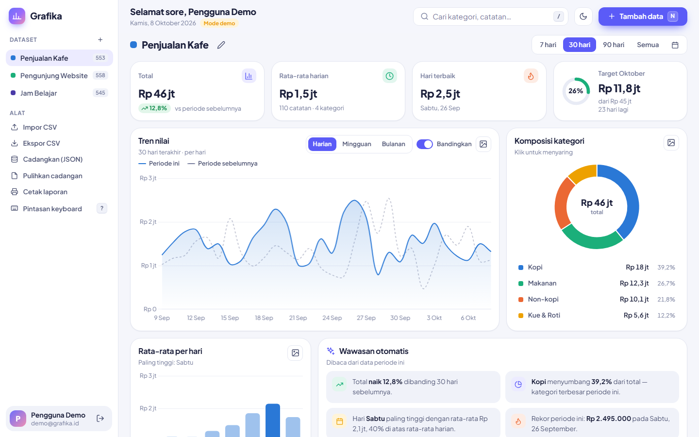
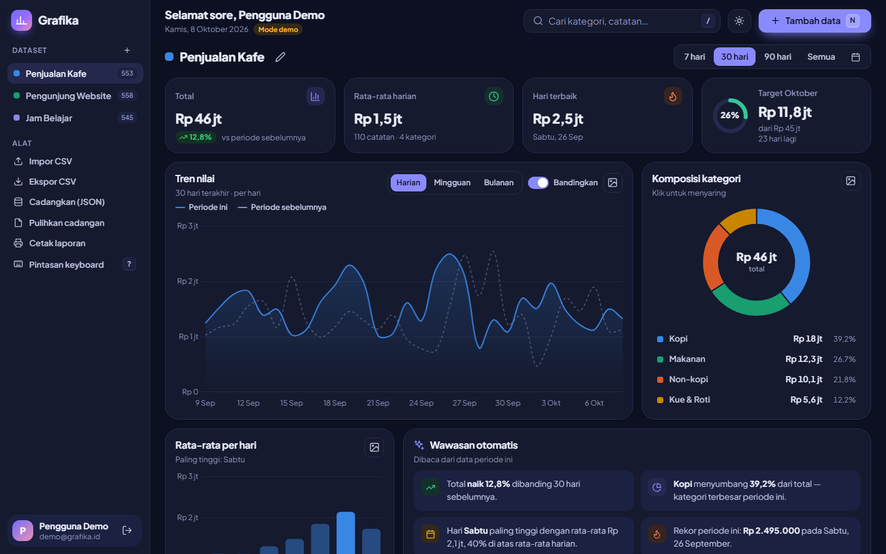
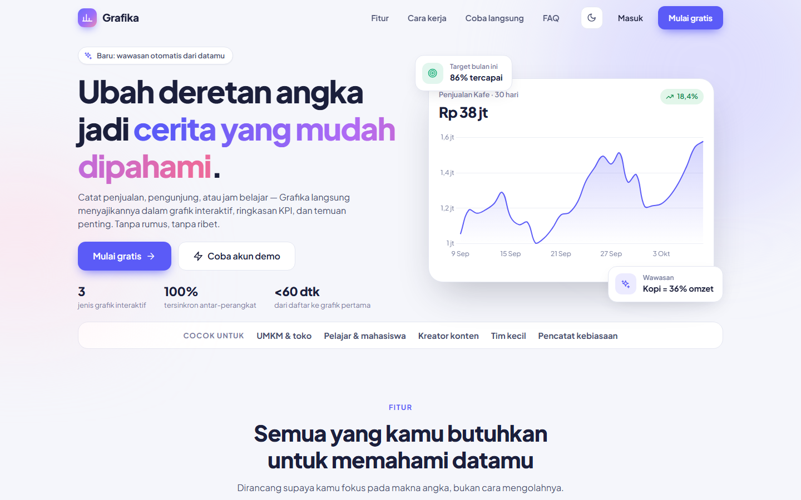
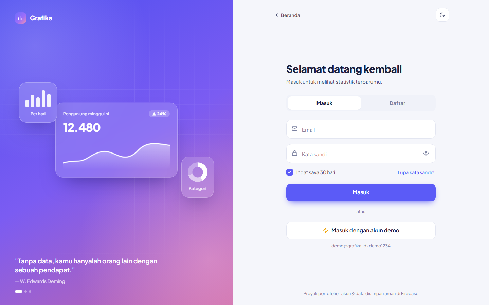
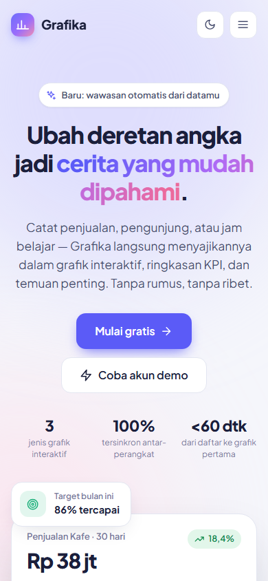
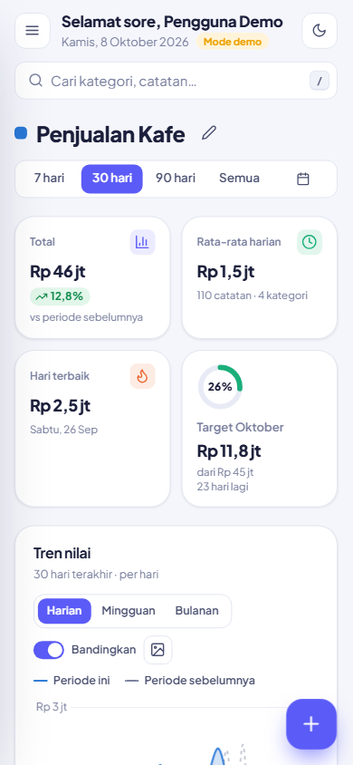

<div align="center">

# Grafika

**Ubah deretan angka jadi cerita yang mudah dipahami.**

Catat angka harian — penjualan, pengunjung, jam belajar — lalu lihat hasilnya sebagai grafik interaktif, ringkasan KPI, dan wawasan otomatis.

[**🔗 Buka aplikasi**](https://grafika-iota.vercel.app) · [**⚡ Coba akun demo**](https://grafika-iota.vercel.app/login?demo=1) · [**💼 LinkedIn pembuat**](https://www.linkedin.com/in/afdhal-anwar-431779211)




</div>

## Tampilan

| Dasbor | Mode gelap |
|---|---|
|  |  |
| **Landing page** | **Halaman masuk** |
|  |  |

<p align="center">
  
  &nbsp;&nbsp;
  
</p>

> **Akun demo:** `demo@grafika.id` / `demo1234` — dipakai bersama, datanya kembali ke contoh awal setiap kali ada yang masuk, jadi bebas dicoba.

**Stack:** Next.js 15 (App Router) · React 19 · TypeScript · Tailwind CSS v4 · Chart.js · Firebase Authentication · Cloud Firestore · Vercel

## Halaman

| Rute | Isi |
|---|---|
| `/` | Landing page: hero dengan grafik "live", fitur, cara kerja, playground grafik interaktif, FAQ, CTA |
| `/login` | Masuk & daftar dalam satu halaman bertab, akun demo, lupa kata sandi (email reset) |
| `/dashboard` | Dasbor statistik lengkap |

## Fitur

**Akun (Firebase Authentication)**
- Daftar & masuk dengan email/kata sandi, "Ingat saya" (sesi lokal vs. sesi tab)
- Lupa kata sandi mengirim email reset sungguhan
- Label mengambang, tombol tampilkan sandi, peringatan Caps Lock, pengukur kekuatan sandi
- Batas 5 percobaan gagal lalu jeda 30 detik (di atas pembatasan bawaan Firebase)
- Akun demo dibuat otomatis saat pertama kali dipakai, form terisi seperti diketik, dan datanya di-reset ke contoh awal setiap kali ada yang masuk

**Dasbor (Cloud Firestore)**
- Banyak dataset, masing-masing dengan satuan, warna, target bulanan, dan arah "naik = baik"
- KPI: total + perubahan vs periode sebelumnya, rata-rata harian, hari terbaik, cincin progres target
- Grafik tren (harian/mingguan/bulanan) dengan garis pembanding periode sebelumnya
- Grafik donat komposisi kategori — klik irisan untuk menyaring seluruh dasbor
- Grafik rata-rata per hari dalam seminggu
- Wawasan otomatis: kenaikan/penurunan, kategori dominan, hari tersibuk, rekor, proyeksi target, streak
- Tambah / ubah / hapus data dengan tombol **Urungkan**
- Tabel riwayat: cari (dengan sorotan), urutkan, paginasi
- Rentang waktu: 7 / 30 / 90 hari, semua, atau tanggal pilihan
- Impor CSV (mendukung `;` dan format angka Indonesia seperti `1.250.000`), ekspor CSV
- Unduh grafik sebagai PNG, cetak laporan
- Cadangkan & pulihkan seluruh data (JSON) — cadangan dari Grafika versi HTML lama juga diterima
- **Sinkron real-time** antar-tab dan antar-perangkat, tetap bisa dipakai saat offline (cache IndexedDB)
- Mode gelap, tampilan ponsel (sidebar geser + tombol tambah mengambang)
- Pintasan keyboard: `N` tambah, `/` cari, `T` tema, `1–9` ganti dataset, `?` bantuan, `Esc` hapus filter

**Lainnya**
- Gambar pratinjau tautan (Open Graph) dibuat otomatis saat build dengan `next/og`, jadi tautan tampil sebagai kartu bergambar di WhatsApp, LinkedIn, dan X

## Menjalankan

```bash
npm install
cp .env.example .env.local   # lalu isi dengan konfigurasi Firebase
npm run dev                  # http://localhost:3000
```

### Menyiapkan Firebase

1. Buka [Firebase Console](https://console.firebase.google.com) dan pilih (atau buat) project.
2. **Project settings → General → Your apps → Add app → Web (`</>`)**. Salin nilai `firebaseConfig` ke `.env.local`.
3. **Build → Authentication → Get started → Sign-in method → Email/Password → Enable**.
4. **Build → Firestore Database → Create database** (jika belum ada), lalu buka tab **Rules**, tempel isi [`firestore.rules`](firestore.rules), dan klik **Publish**.
5. Jalankan ulang `npm run dev`.

Tanpa `.env.local`, landing page tetap jalan; halaman masuk & dasbor menampilkan petunjuk penyiapan.

### Deploy ke Vercel

Impor repo di Vercel, lalu isi enam variabel `NEXT_PUBLIC_FIREBASE_*` di **Settings → Environment Variables**. Tambahkan domain Vercel-mu di Firebase Console → Authentication → Settings → **Authorized domains**.

## Struktur data

```
grafika_users/{uid}                  → profil: nama, email, dataset aktif, status sambutan
grafika_users/{uid}/datasets/{id}    → satu dataset beserta seluruh entrinya
```

Satu dokumen per dataset berarti sekali baca untuk ratusan entri (hemat kuota gratis Firestore). Batas 1 MB per dokumen cukup untuk sekitar 10.000 entri per dataset. Aturan keamanan memastikan setiap pengguna hanya bisa membaca dan menulis datanya sendiri.

## Struktur kode

```
src/
├── app/                 layout (font, tema, provider), /, /login, /dashboard
├── components/
│   ├── landing/         navigasi, grafik hero, playground, animasi muncul
│   ├── auth/            layar masuk/daftar, panel ilustrasi
│   ├── dashboard/       dasbor, grafik, KPI, wawasan, tabel, modal, hook data Firestore
│   └── …                Icon, Toast, Modal, tema, AuthProvider, ChartCanvas
└── lib/
    ├── analytics.ts     perhitungan statistik (murni, tanpa React)
    ├── csv.ts           impor/ekspor CSV
    ├── auth.ts          daftar, masuk, akun demo, reset sandi
    ├── store.ts         baca/tulis Firestore
    ├── firebase.ts      inisialisasi App & Auth
    ├── db.ts            inisialisasi Firestore (dipisah agar landing tetap ringan)
    ├── seed.ts          data contoh 150 hari
    └── format.ts        format angka & tanggal (id-ID)
```

## Pembuat

**Afdhal Anwar** — dibuat sebagai proyek portofolio frontend.

[](https://www.linkedin.com/in/afdhal-anwar-431779211)
[](https://github.com/afdhalwr)
